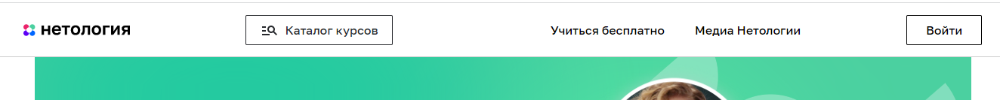
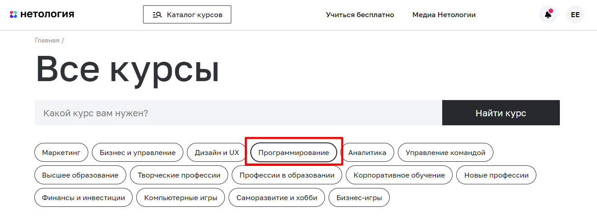
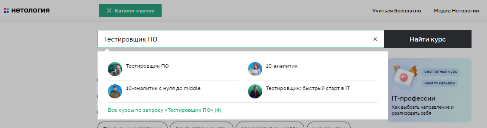
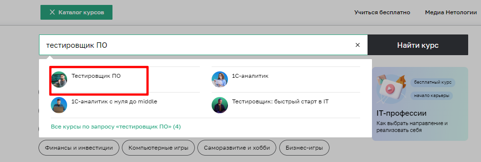
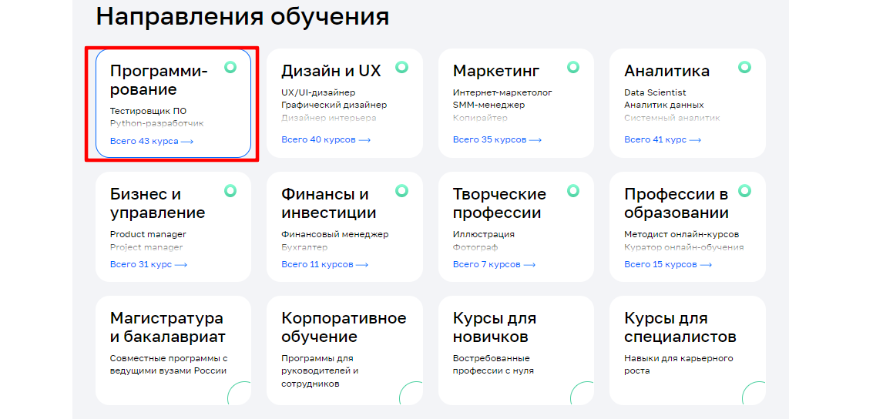
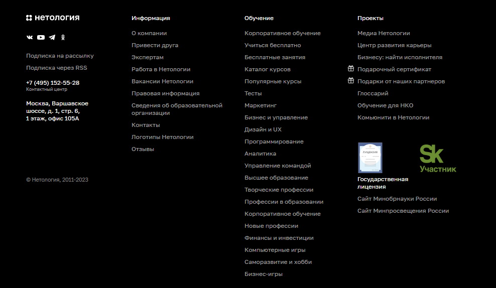
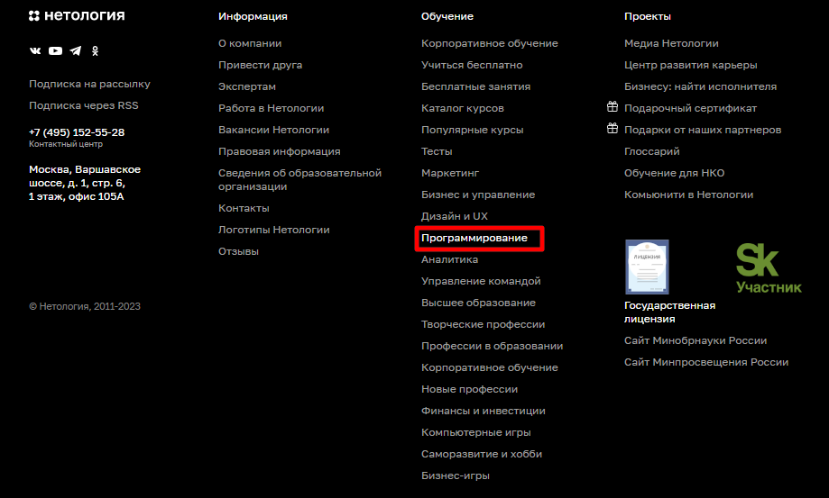
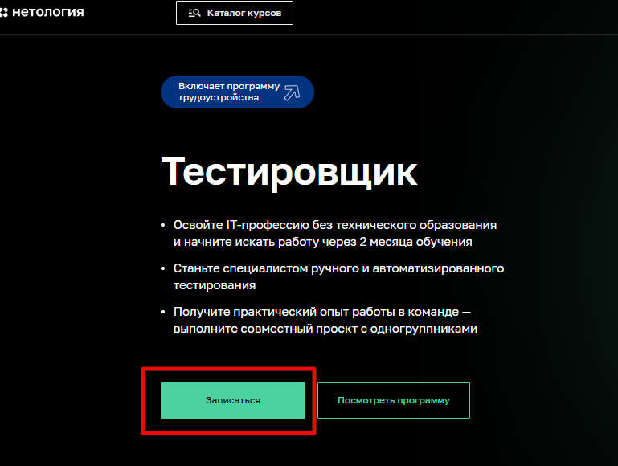
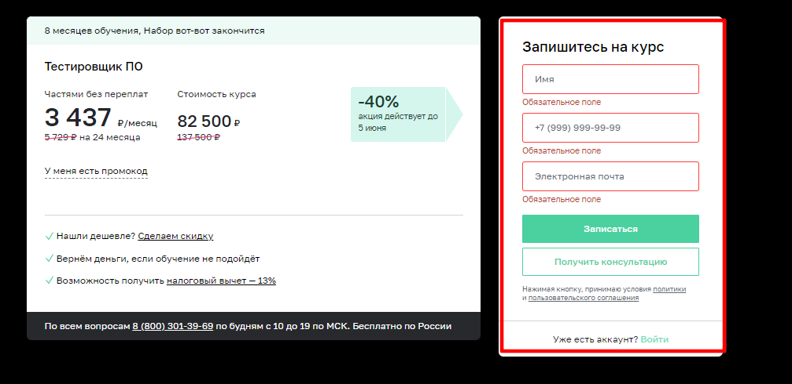
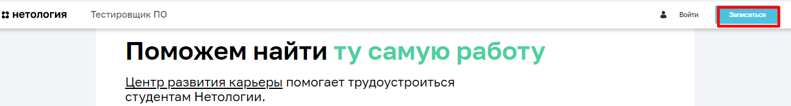

# План автоматизации возможности записи на курс по профессии "Тестировщик ПО".

### **I. Перечень автоматизируемых сценариев.**  
#### **1.1. Переход на страницу "Тестировщик ПО"**
*Сценарий №1.* Переход через кнопку "Каталог курсов" на главной страницы [веб-сайта Нетологии](https://netology.ru/).
1. Открыть [сайт](https://netology.ru/);
2. Нажать внопку "Каталог курсов" в хедере сайта:

3. На открывшейся странице нажать кнопку "Програмирование":

1. Нажать вкладку "Тестировщик ПО":

*Сценарий №2.* Переход через поиск в каталоге курсов.
1. Открыть [сайт](https://netology.ru/);
2. Нажать внопку "Каталог курсов" в хедере сайта:

3. Ввести в строке поиска название курса "Тестировщик ПО":

4. Нажать в выпадающем меню "Тестировщик ПО":
 
5. Нажать вкладку "Тестировщик ПО":

*Сценарий №3.* Переход через направления обучения
1.  Открыть [сайт](https://netology.ru/);
2.  Прокрутить страницу вниз до блока "Направления обучения";
3.  Нажать на кнопку "Програмирование":
 
4.  Нажать вкладку "Тестировщик ПО":

*Сценарий №4.* Переход на страницу профессии через меню футера
1. Открыть [сайт](https://netology.ru/);
2. Прокрутить страницу вниз до меню футера:

3. Нажать на вкладку "Програмирование" в меню "Обучение":

Нажать вкладку "Тестировщик ПО":

#### **1.2. Заполнение формы записи на обучение по професии "Тестировщик ПО"**

*Сценарий №1.* Заполнение формы через кнопку "Записаться" на странице профессии
1. На странице професси нажать кнопку "Записаться":

2. Ввод валидных данных в поле "Имя" в форме "Запишитесь на курс"
3. Ввод валидных данных в поле "+7 (999) 999-99-99 " в форме "Запишитесь на курс"
4. Ввод валидных данных в поле "Электронная почта" в форме "Запишитесь на курс"
5. Нажать кнопку "Записаться" в форме "Записаться на курс":

*Сценарий №2.* Заполнение формы через кнопку "Записаться" в хедере страницы профессии
1. На странице професси нажать кнопку "Записаться" в хедере:

2. Ввод валидных данных в поле "Имя" в форме "Запишитесь на курс"
3. Ввод валидных данных в поле "+7 (999) 999-99-99 " в форме "Запишитесь на курс"
4. Ввод валидных данных в поле "Электронная почта" в форме "Запишитесь на курс"
5. Нажать кнопку "Записаться" в форме "Записаться на курс":

*Сценарий №3.* Заполнение формы через кнопку "Записаться" в конце страницы профессии
1. Пролистать всю страницу профессии до формы записи на курс.
2. Ввод валидных данных в поле "Имя" в форме "Запишитесь на курс"
3. Ввод валидных данных в поле "+7 (999) 999-99-99 " в форме "Запишитесь на курс"
4. Ввод валидных данных в поле "Электронная почта" в форме "Запишитесь на курс"
5. Нажать кнопку "Записаться" в форме "Записаться на курс":

#### **1.3. Тестовый сценарий ввода данных.**
*Позитивный сценарий:* 
1. Поле "Имя" заполнено на латинице или кирилице, не короче 2-х символов;
2. Поле "+9(999)999-99-99" заполнено цифровым значением в количестве 11, начинается с +7, или 8;
3. Поле "Электронная почта" заполнено латиницей с локальной частью адреса, символом "@" и доменной частью имени с точкой.

*ОР:* При нажатии кнопки "Записаться", происходит переход на экран оплаты курса.

*Негативные сценарии:*
1. Поле "Имя" не заполнено; 
2. Поле "+9(999)999-99-99" заполнено цифровым значением в количестве 11, начинается с +7, или 8;
3. Поле "Электронная почта" заполнено кириллицей с локальной частью адреса, символом "@" и доменной частью имени с точкой.
   
*ОР:* Ошибка ввода данных, обозначенная красной рамкой вокруг поля "Имя" и сообщением под ним: "Обязательное поле".

1. В поле "Имя" введен один буквенный символ; 
2. Поле "+9(999)999-99-99" заполнено цифровым значением в количестве 11, начинается с +7, или 8;
3. Поле "Электронная почта" заполнено кириллицей с локальной частью адреса, символом "@" и доменной частью имени с точкой.
   
*ОР:* Ошибка ввода данных, обозначенная красной рамкой вокруг поля "Имя" и сообщением под ним: "Должно быть не короче 2 символов".

1. В поле "Имя" введены цифры; 
2. Поле "+9(999)999-99-99" заполнено цифровым значением в количестве 11, начинается с +7, или 8;
3. Поле "Электронная почта" заполнено кириллицей с локальной частью адреса, символом "@" и доменной частью имени с точкой.
   
*ОР:* Ошибка ввода данных, обозначенная красной рамкой вокруг поля "Имя" и сообщением под ним: "Должно состоять из букв".

1. Поле "Имя" заполнено на латинице или кирилице, не короче 2-х символов;
2. В поле с номером телефона введены буквенное значение/спецсимволы/цифры, в количестве, превышающем 11/цифры, в количестве менее 11;
3. Поле "Электронная почта" заполнено кириллицей с локальной частью адреса, символом "@" и доменной частью имени с точкой.

*ОР:* Ошибка ввода данных, обозначенная красной рамкой вокруг поля "+9(999)999-99-99" и сообщением под ним: "Номер в формате +9(999)999-99-99".

1. Поле "Имя" заполнено на латинице или кирилице, не короче 2-х символов;
2. Поле с номером телефона не заполнено;
3. Поле "Электронная почта" заполнено кириллицей с локальной частью адреса, символом "@" и доменной частью имени с точкой.

*ОР:* Ошибка ввода данных, обозначенная красной рамкой вокруг поля "+9(999)999-99-99" и сообщением под ним: "Обязательное поле".

1. Поле "Имя" заполнено на латинице или кирилице, не короче 2-х символов;
2. Поле "+9(999)999-99-99" заполнено цифровым значением в количестве 11, начинается с +7, или 8;
3. Поле "Электронная почта" заполнено кириллицей/отсутствует символ "@" или доменная часть имени с точкой.

*ОР:* Ошибка ввода данных, обозначенная красной рамкой вокруг поля "Электронная почта" и сообщением под ним: "Неверный email".

1. Поле "Имя" заполнено на латинице или кирилице, не короче 2-х символов;
2. Поле "+9(999)999-99-99" заполнено цифровым значением в количестве 11, начинается с +7, или 8;
3. Поле "Электронная почта" не заполнено.

*ОР:* Ошибка ввода данных, обозначенная красной рамкой вокруг поля "Электронная почта" и сообщением под ним: "Обязательное поле".

1. В форме заполнено только одно поле.

*ОР:* Ошибка ввода данных, обозначенная красной рамкой вокруг незаполненных полей и сообщением под ними: "Обязательное поле".

1. В форме не заполнены все поля.

*ОР:* Ошибка ввода данных, обозначенная красной рамкой вокруг незаполненных полей и сообщением под ними: "Обязательное поле".

### **II Перечень используемых инструментов**

1. Язык написания тестов: Java.
2. Среда разработки: Intellij IDEA.
3. Тестовая среда: JUnit - для создания юнит-тестов.
4. Система сборки: Gradle - для простоты подключения зависимостей и плагинов.
5. Библиотеки: 
    - Facker  - для генерирования данных случайных пользователей.
    - Selenide - для тестирования веб-интерфейсов.
    - Lombok - для генерации кода.
6. Система отчетов: Allure - для создания информативных отчетов тестирования.
7. Система управления версиями: GIT - самый распространенный.
8. Командная оболочка: Bash - для удобства. 

### **III Перечень необходимых разрешений, данных и доступов**

1. Доступ к тестовым данным.
2. Разрешение на проведение тестирования сайта от  Нетологии
   
### **IV Перечень и описание возможных рисков при автоматизации**

Изменение архитектуры сайта, дизайна, верстки.

### **V Перечень необходимых специалистов для автоматизации**

QA инженер с навыками автоматизации.

### **VI Интервальная оценка с учётом рисков в часах**

Примерно 3-4 дня, 24-32 часа.

   
  
    

